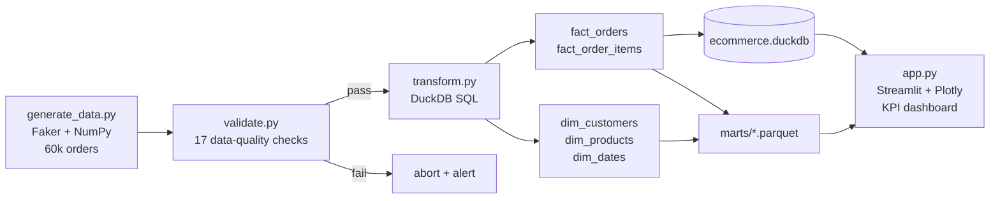
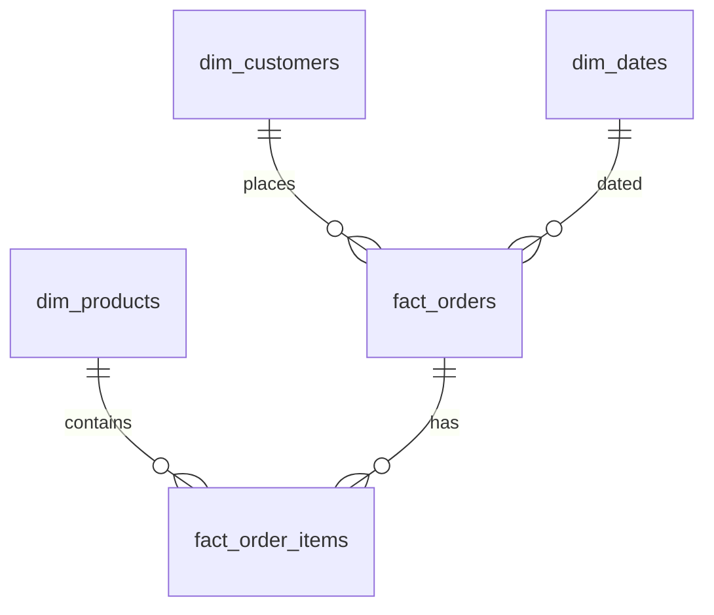

# 🛒 E-commerce Analytics Platform


An **end-to-end data engineering project**: synthetic e-commerce data → validated
ELT pipeline → DuckDB star-schema warehouse → interactive BI dashboard —
containerized and deployed.

**🚀 Live demo:** *(deployed app URL goes here)*

---

## 🏗️ Architecture



## ✨ What it does

- **Extract** — generates a realistic, seeded dataset: 5,000 customers, 48 products
  across 8 categories, 60,000 orders (Jul 2024 – Dec 2025) with a business-growth
  ramp and skewed repeat-purchase behavior
- **Validate** — 17 data-quality checks before anything loads: PK uniqueness,
  FK integrity, email format, price/discount sanity, date ranges
- **Transform** — models a **star schema** in DuckDB (`dim_*` + `fact_*`) plus a
  `mart_monthly_kpis` view; exports Parquet marts
- **Serve** — Streamlit dashboard: revenue KPIs, monthly trend, category mix,
  top products, payment mix, and a **cohort retention heatmap**
- **Test** — end-to-end `pytest` suite (generate → validate → transform →
  assert warehouse invariants)

## 🚀 Quickstart

```bash
pip install -r requirements.txt

# run the full pipeline (generate → validate → transform)
make pipeline        # or: python pipeline/run_pipeline.py
make pipeline-tiny   # fast 1k-order run for development

# launch the dashboard
make app             # or: streamlit run app.py

# run tests
make test
```

Or with Docker:

```bash
docker build -t ecommerce-analytics .
docker run -p 8501:8501 ecommerce-analytics
```

## 📁 Project structure

```
├── app.py                  # Streamlit BI dashboard (Plotly)
├── pipeline/
│   ├── generate_data.py    # synthetic data generator (Faker, seeded)
│   ├── validate.py         # 17 data-quality checks
│   ├── transform.py        # DuckDB star-schema modeling + Parquet marts
│   └── run_pipeline.py     # orchestrator with logging & timing
├── tests/
│   └── test_pipeline.py    # end-to-end pipeline test
├── data/                   # generated at runtime (gitignored)
│   ├── raw/                # CSV extracts
│   ├── warehouse/          # ecommerce.duckdb (star schema)
│   └── marts/              # Parquet marts
├── Dockerfile
├── Makefile
└── requirements.txt
```

## 🧠 Data model



## 🏭 Production extensions

What I'd add to run this for real:

| Area | This project | Production |
|---|---|---|
| Orchestration | `run_pipeline.py` | Apache Airflow DAGs with retries, SLAs, alerting |
| Transform | DuckDB SQL | dbt models + tests + docs |
| Validation | pandas checks | Great Expectations / Soda suites in CI |
| Warehouse | DuckDB file | Snowflake / BigQuery |
| Ingestion | Faker | Kafka / Kinesis CDC → Bronze/Silver/Gold (Delta Lake) |
| BI | Streamlit | Streamlit + scheduled PDF snapshots, or Power BI |
| CI/CD | pytest | GitHub Actions: lint → test → build → deploy |

---

Built as part of a every-3-days portfolio build series. PRs and feedback welcome!
